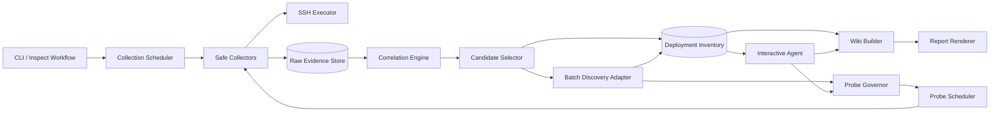
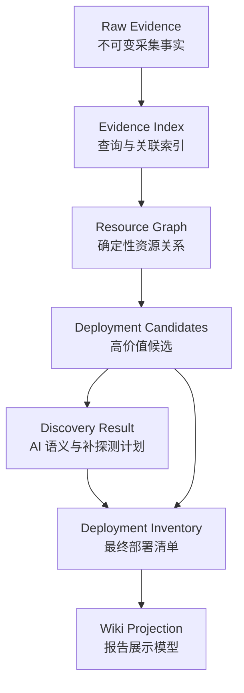
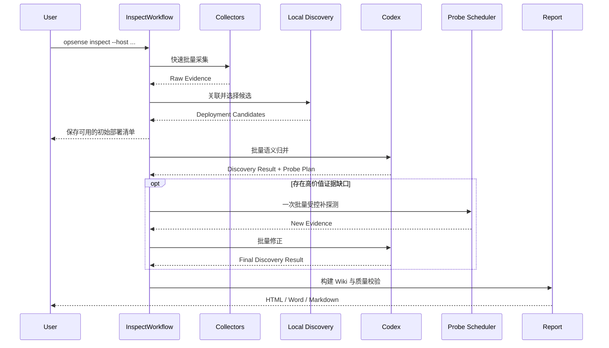

# OpSense 架构设计 v3.0

## 1. 文档目的

本文定义 OpSense v3.0 的目标架构、核心流程、模块边界、数据分层、运行约束和关键架构决策。

v3.0 聚焦一个清晰目标：

> 快速扫描一台 Linux 服务器，可靠整理服务器上部署了哪些应用和基础组件，并输出可追溯的部署清单与服务器 Wiki；对少量无法确定的对象，再通过受控探测和交互式 Agent 深入调查。

本文解决“系统应该如何拆分和协作”。具体命令、算法、接口、实施步骤和测试方案见 [技术方案 v3.0](./技术方案v3.0.md)。

v3.0 按未正式发布产品的全新主线设计，不承担旧版本数据、CLI、工作区或 Agent Session 的兼容责任。已有实现只作为问题样本和可复用代码来源，不构成新架构约束。

## 2. 背景与问题

### 2.1 v2.0 流程的问题

v2.0 将 Agent 调查循环放在主流程中：模型读取上下文、选择一个工具、执行一个动作、保存结果，再进入下一轮。该方式安全且可审计，但不适合“服务器部署盘点”这种大部分事实可以通过确定性规则归并的任务。

主要问题如下：

1. 初始扫描会对大量路径递归扫描，并逐个读取配置文件。
2. systemd unit 和 Docker 容器存在逐对象远程查询，SSH 往返次数随对象数量线性增长。
3. 每个模型回合只能选择一个工具，读取、分类、更新和结束都需要独立 Codex turn。
4. 工具业务校验失败后需要新的模型回合修复，错误成本很高。
5. 服务发现、Wiki 编排和交互式调查共享同一完成门禁，用户必须等待完整 Agent 收敛才能获得结果。
6. 原始证据、发现工作区和最终 Wiki 投影虽然在概念上分层，实际仍集中在一个持续重建的 Projection 中。

### 2.2 当前性能基线

本机历史真实运行样本显示：

| 指标 | 历史样本 |
| --- | ---: |
| SSH 扫描耗时 | 33.4 秒 |
| SSH 命令数 | 621 |
| Agent turn | 44 |
| Agent 总耗时 | 3581.9 秒 |
| Agent 平均 turn | 81.4 秒 |
| SDK 统计总 token | 约 329 万 |
| 失败的计划或投影更新 turn | 11 |

其中 `directory.scan`、`directory.read-config`、`service.systemd-show` 和 `docker.inspect` 共 548 次，占 SSH 命令总数约 88%。Agent 耗时约为扫描耗时的 107 倍，是端到端体验的主要瓶颈。

这些数据只作为 v3.0 的优化基线，不代表所有服务器的通用性能。

## 3. v3.0 架构结论

### 3.1 主流程改为固定流水线

v3.0 使用可预测的阶段式流水线生成第一次部署清单和 Wiki：

```text
快速采集
  -> 本地事实关联
  -> 高价值部署候选
  -> Codex 批量语义归并
  -> 可选的一轮受控补探测
  -> 最终部署清单
  -> Wiki 投影与报告
```

Agent 不再负责驱动整个首次扫描，而是在已有部署清单和 Wiki 上执行后续调查。

### 3.2 确定性层负责事实，AI 负责语义

本地确定性代码负责：

- 采集系统、进程、端口、systemd、Docker、Compose、挂载和路径事实。
- 根据 PID、cgroup、unit、容器 ID、Compose 标签、端口和路径建立关联。
- 保护容器、自定义 unit、监听端口、失败服务、自定义可执行路径和数据挂载等高价值对象。
- 聚合普通系统对象，但不擅自判断业务用途。
- 校验证据引用、安全边界、预算和最终完整度。

Codex 负责：

- 判断候选服务的业务或基础设施语义。
- 合并属于同一部署单元的多个候选。
- 决定哪些未知项值得补探测。
- 根据新证据修正服务名称、角色、用途和待确认项。
- 撰写面向运维人员的服务器级概览和服务说明。

### 3.3 首次结果不依赖 Agent 收敛

v3.0 将产品输出分成三个等级：

| 等级 | 依赖 | 输出 |
| --- | --- | --- |
| Evidence Inventory | SSH 与本地规则 | 原始事实、部署候选、端口和路径线索 |
| Deployment Inventory | 可选 Codex | 归并后的部署服务清单、置信度和未知项 |
| Server Wiki | Codex 或明确标记的基础模式 | 运维说明、服务手册和多格式报告 |

Codex 不可用时，系统仍然可以完成扫描并输出明确标记为“未进行 AI 语义确认”的证据型部署清单。只有声称完成语义归并的正式 AI Wiki 才要求 Codex 成功。

这与 v2.0 的“Codex 不可用则不产生结果”不同，是 v3.0 的显式产品决策。

### 3.4 默认只做一轮按需补探测

初始扫描不再递归读取所有候选目录和配置。Codex 批量分类后，可以申请一轮结构化补探测。本地调度器负责去重、合并和并发执行。

用户显式选择 `deep` profile 或在 Agent 中继续调查时，才允许增加探测轮数。

## 4. 总体架构



### 4.1 依赖方向

模块依赖必须保持单向：

```text
CLI
  -> Application Workflows
      -> Collection / Correlation / Discovery / Wiki
          -> Domain Schema
              -> 无基础设施依赖
```

领域模型不得依赖 SSH、Codex SDK、CLI 或报告渲染器。Codex 和 SSH 都通过端口接口接入应用层。

## 5. 核心模块

### 5.1 `InspectWorkflow`

负责 v3.0 默认端到端流程：

1. 创建 ScanRun。
2. 启动快速采集。
3. 生成本地部署候选并立即持久化。
4. 根据 profile 决定是否调用 Codex。
5. 执行最多一轮受控补探测。
6. 固化 Deployment Inventory。
7. 生成 Wiki 和报告。

它只负责编排，不包含采集解析、服务识别或报告业务规则。

### 5.2 `CollectionScheduler`

统一管理所有 SSH 采集任务，替代各 Collector 内部重复的并发实现。

职责包括：

- 全局 SSH channel 并发限制。
- 任务优先级和依赖关系。
- 命令批处理、超时、取消和输出预算。
- 相同命令及参数的运行内缓存。
- 排队时间、执行时间、输出大小和状态指标。
- 远端能力探测和降级变体选择。

### 5.3 `SafeCollectors`

Collector 只执行固定、版本化、只读命令规格，不接受任意 Shell 字符串。

Collector 分为：

- `baseline`：主机、存储、网络基础信息。
- `runtime`：进程、端口、systemd、Docker、Compose。
- `path-metadata`：已知路径元数据，不默认递归。
- `governed-probe`：经策略批准的目录、配置、进程、unit、容器和日志补探测。

### 5.4 `RawEvidenceStore`

保存不可变的采集事实和命令执行记录。写入采用 append-only 语义，派生结果不能覆盖原始 Evidence。

职责包括：

- Evidence ID 与内容哈希。
- 按对象、来源、命令、服务候选和路径建立轻量索引。
- 增量追加补探测结果。
- 为 Codex 和报告提供脱敏后的按需查询。
- 保存采集覆盖范围和失败原因。

v3.0 首期采用 JSONL 加紧凑 JSON 索引；当单次扫描数据量或查询耗时超过阈值后，再通过相同接口替换为 SQLite。

### 5.5 `CorrelationEngine`

只根据确定性关系构建资源图，不进行产品语义判断。

主要关联键：

- systemd `MainPID` 与进程 PID。
- 进程 PID、PPID 与进程树。
- 进程 cgroup 与 unit、容器。
- socket owner PID 与进程。
- 容器 init PID、容器 ID 与 cgroup。
- Compose project/service 标签与容器。
- 宿主机端口映射与容器端口。
- unit `WorkingDirectory`、`ExecStart`、EnvironmentFile 与路径。
- Docker mount 源路径与容器、服务。

输出为 `ResourceGraph` 和未归并的资源集合。

### 5.6 `CandidateSelector`

从资源图生成少量高价值 `DeploymentCandidate`。选择依据必须是客观信号，而不是固定产品名称。

保护信号包括：

- Docker 或 Compose 部署。
- 主机监听端口，尤其是非 loopback 暴露。
- 自定义 systemd unit。
- 自定义执行文件或工作目录。
- `/opt`、`/srv`、`/data`、`/app`、`/home`、`/usr/local` 下的服务路径。
- 数据、日志或备份挂载。
- 失败或冲突状态。
- 无法归属但具有长期运行或服务特征的进程。

没有保护信号的普通 systemd unit 和操作系统进程进入聚合组，不产生逐项 AI 任务。

### 5.7 `BatchDiscoveryAdapter`

将紧凑的候选索引一次性提交给 Codex，并要求返回结构化发现结果。

正常流程只允许：

1. 一次批量发现调用。
2. 可选的一次补探测后修正调用。
3. 一次 Wiki 综合撰写调用。

格式修复可以在同一次 SDK run 内进行，不计为新的应用层 turn。业务校验应尽可能逐项返回错误，避免整批失败。

### 5.8 `ProbeGovernor` 与 `ProbeScheduler`

`ProbeGovernor` 负责安全与预算，`ProbeScheduler` 负责执行效率，二者分离。

Governor 校验：

- Probe 类型与参数 Schema。
- 来源 Candidate、Evidence 或 Investigation ID。
- 路径根、深度、匹配数、读取字节和超时。
- 会话级总请求数、总输出和总时长。
- 敏感路径、运行时目录和数据库内部目录禁区。

Scheduler 负责：

- 语义相同请求去重。
- 同一路径祖先请求合并。
- systemd、Docker 和文件元数据批量执行。
- 并发、重试、缓存和结果归集。

### 5.9 `WikiBuilder`

从稳定的 Deployment Inventory 构建 Wiki Projection。

- 结构化事实表格由本地代码生成。
- 服务状态、端口、路径和证据引用不能由 AI 自由改写。
- Codex 只生成用途描述、部署概览、运维提示、重点发现和待确认项。
- `compose_wiki` 成功且本地质量门禁通过后，由本地直接结束流程，不再请求模型返回 ceremonial `final`。

### 5.10 `InteractiveAgent`

Agent 变为报告后的增强入口：

- 深入调查指定服务。
- 解释端口、目录、挂载和部署关系。
- 对未知项发起新的受控探测。
- 基于新证据生成 Wiki Revision。

Agent 的完成状态不影响初始 Deployment Inventory 的可用性。

## 6. 数据分层



### 6.1 `RawEvidence`

只包含事实：采集值、来源、状态、时间、敏感级别、命令规格版本和内容哈希。

### 6.2 `ResourceGraph`

表示主机、unit、进程、socket、容器、Compose、挂载和路径之间的确定性关系。每条边必须引用 Evidence ID 和关联规则。

### 6.3 `DeploymentCandidate`

是进入语义识别的候选部署单元，不等同于最终服务，也不承载确定的业务用途。

### 6.4 `DeploymentInventory`

是 v3.0 的核心交付模型，至少包含：

- 服务名称、显示名称、角色和用途。
- 部署类型和运行状态。
- unit、进程、容器和 Compose 关联。
- 主机地址、主机端口、容器端口及暴露范围。
- 部署、配置、环境、日志、数据和备份路径。
- 可信事实、AI 推断、未知项和冲突。
- Evidence ID、来源对象和最近确认时间。
- 发现来源：`deterministic`、`codex` 或 `human`。

### 6.5 `WikiProjection`

只保存最终展示所需内容，不重复保存完整原始 Evidence。它通过稳定 ID 引用 Deployment Inventory 和 Evidence Store。

## 7. 标准运行时序

### 7.1 `standard` profile



### 7.2 扫描 profile

| Profile | 用途 | 初始目录行为 | AI | Probe |
| --- | --- | --- | --- | --- |
| `fast` | 快速查看部署清单 | 只取明确路径元数据 | 可关闭 | 0 轮 |
| `standard` | 默认 Wiki 生成 | 只取高价值根元数据 | 2～3 次批量调用 | 最多 1 轮 |
| `deep` | 显式深度调查 | 受预算限制的目录与配置采集 | 最多 4 次批量调用 | 最多 3 轮 |

`deep` 不得成为默认值。

## 8. 完成门禁

### 8.1 快速扫描完成

满足以下条件即可输出 Evidence Inventory：

- 核心主机、进程、端口和服务入口采集已完成或明确失败。
- 原始证据已脱敏并持久化。
- 高价值部署候选已生成。
- 所有失败和权限缺口已记录。

### 8.2 部署发现完成

满足以下条件即可固化 Deployment Inventory：

- 每个受保护候选均已保留、合并、过滤或标记 `needs_review`。
- 所有对外端口均已关联服务或进入待确认列表。
- 每个容器、Compose 项目、自定义 unit 和自定义进程均有归属或明确未知。
- 必要 Probe 已完成、拒绝、失败或被预算终止，并保留原因。
- 普通系统对象已形成可追溯聚合组。

完成条件不得再依赖“每个原始 service/path 都有独立 assessment”。

### 8.3 Wiki 完成

- Deployment Inventory 已冻结并具有版本哈希。
- Wiki Narrative 引用该版本哈希。
- 服务分组完整且不重复。
- 不存在未知服务 ID、Evidence ID 或无依据生命周期命令。
- 敏感信息残留扫描通过。
- HTML、Word 和 Markdown 使用同一 Wiki Projection。

## 9. 性能与资源预算

以下指标适用于 RTT 不高于 50 ms、少于 500 个 systemd unit、少于 100 个容器的标准样本：

| 指标 | v3.0 目标 |
| --- | ---: |
| 首个 Evidence Inventory | P50 ≤ 30 秒，P95 ≤ 60 秒 |
| 基础 SSH 命令数 | ≤ 40 |
| systemd 详情查询 | 按 32～64 个 unit 分块 |
| Docker inspect | 按 32～64 个容器分块 |
| 默认补探测轮数 | ≤ 1 |
| 正常 Codex 应用层调用 | 2～3 次 |
| 最大 Codex 应用层调用 | ≤ 6 次 |
| 会话级最大 turn | ≤ 12 |
| 标准样本总 token | P50 ≤ 30 万，P95 ≤ 50 万 |
| 完整 Wiki 总耗时 | P50 ≤ 5 分钟，P95 ≤ 10 分钟 |

外部模型排队和服务异常需要单独统计，不得混入 SSH 扫描耗时。

## 10. 持久化架构

建议的 v3.0 工作区：

```text
~/.opsense/runs/<scan-id>/
|-- run.json
|-- metrics.json
|-- audit.jsonl
|-- evidence.jsonl
|-- evidence-index.json
|-- resource-graph.json
|-- deployment-candidates.json
|-- discovery-result.json
|-- probe-results.jsonl
|-- deployment-inventory.json
|-- wiki-projection.json
|-- agent/
|   |-- sessions/<session-id>.json
|   |-- turns.jsonl
|   `-- transcript.jsonl
`-- reports/
    |-- index.html
    |-- README.md
    `-- server-wiki.docx
```

写入原则：

- Evidence 和审计记录只追加。
- 每个阶段产物带 `schemaVersion`、`sourceHash` 和 `generatedAt`。
- 阶段产物通过临时文件加原子替换写入。
- 重跑时根据输入哈希复用未失效阶段。
- Probe 使用语义缓存键，避免不同 Request ID 重复执行相同请求。

## 11. 安全边界

v3.0 的性能优化不得削弱以下约束：

- Codex 不直接连接服务器，不持有 SSH Executor。
- Codex 不能生成或执行任意 Shell 字符串。
- 所有批量命令仍来自固定命令目录，参数逐项验证。
- 远程操作保持只读，不执行配置修改、启停、安装或修复。
- 配置内容在进入 Evidence Store、Codex 和报告前脱敏。
- 不读取进程环境变量值；容器环境变量默认只保留键名。
- 目录探测遵守根目录、文件系统边界、深度、条目数、字节数和超时限制。
- 批量执行中任何一个对象失败时必须保留对象级状态，不能用整批成功掩盖。

## 12. 可观测性

每次运行必须生成 `metrics.json`，至少记录：

- 各阶段开始、结束和耗时。
- SSH 命令总数、按 command ID 分组的次数和耗时。
- SSH 排队时间、执行时间、超时、截断和缓存命中。
- 原始对象数、候选数、保护候选数、过滤组数和最终服务数。
- Codex 调用数、每次耗时、input/output/reasoning token 和格式修复次数。
- Probe 请求数、去重数、接受数、拒绝数、失败数和有效信息增益。
- 报告生成时间和质量门禁结果。

CLI 应实时区分：

```text
[Scan] 运行态采集 18/24，耗时 8.2s
[Discovery] 生成 12 个高价值候选，聚合 146 个系统对象
[AI] 批量归并 1/2，耗时 42.1s
[Probe] 执行 6 个请求，去重后 4 个
[Report] 正在生成 Wiki
```

## 13. 失败与恢复

### 13.1 SSH 部分失败

保留成功证据并生成 `partial` Evidence Inventory。不得因为 Docker 无权限或某个命令缺失而丢弃整个扫描。

### 13.2 Codex 不可用

输出本地 Deployment Inventory，明确标记：

- `semanticStatus: unverified`
- 未执行 AI 归并的原因。
- 后续可运行的恢复命令。

不得将本地候选名称表述为已经确认的业务用途。

### 13.3 Probe 失败

单个 Probe 失败不终止发现流程。该字段进入未知项，记录权限、超时、路径不存在或预算不足原因。

### 13.4 恢复

恢复以阶段产物和内容哈希为依据：

- 已完成快速扫描则不重新 SSH 扫描。
- 已完成且输入未变化的 Codex 批量结果可以复用。
- 已成功的 Probe 根据语义缓存键复用。
- 如果恢复时没有 SSH 连接，只允许离线完成已有证据的归并和报告；需要新 Probe 时明确提示重新连接。

## 14. 版本策略

v3.0 是新的唯一主线，不设置兼容窗口和双轨实现：

- 不读取或迁移旧版 `snapshot.json`、`InventoryProjection`、Agent Session 和报告中间产物。
- 不保留旧 CLI 参数、旧工作流入口或旧完成门禁的兼容分支。
- 不为旧 Schema 增加 Adapter、Fallback 或版本判断。
- 旧本地工作区由开发者自行删除或归档；v3.0 遇到旧格式时直接给出明确的不兼容提示。
- 旧设计文档保留在 `docs/v1.0` 和 `docs/v2.0` 作为历史记录，不影响 v3.0 实现。
- 已验证有效的 SSH 安全、脱敏、解析和报告代码可以重用，但必须适配 v3.0 接口和数据流。

该策略允许直接删除单工具 Agent 主循环、旧 Projection 聚合模型和历史兼容代码，避免新架构继续背负未发布版本的技术债。

## 15. 关键架构决策

### ADR-01：固定流水线取代 Agent 主循环

首次盘点是有确定阶段和完成标准的任务，固定流水线更快、更容易测试和恢复。Agent 只负责后续开放式调查。

### ADR-02：部署候选先由本地资源图生成

unit、进程、端口、容器和路径之间的关系具有确定性，不应消耗模型推理成本。

### ADR-03：AI 使用批量请求

正常流程不允许逐服务调用模型。候选分类、补探测修正和 Wiki 撰写分别采用批量契约。

### ADR-04：目录与配置默认按需读取

完整证据不等于一次性读取全部内容。v3.0 通过覆盖状态和可恢复补探测实现渐进式完整性。

### ADR-05：基础部署清单不以 Codex 为硬依赖

服务器事实盘点必须在模型不可用时仍有价值；AI 语义结果和正式 AI Wiki 必须明确区分。

### ADR-06：本地完成门禁取代模型 final

流程是否完成由 Schema、证据覆盖、预算和质量规则决定，不需要模型再返回一个无事实增量的结束动作。

## 16. v3.0 Definition of Done

- 默认入口可以在快速扫描完成后立即得到证据型部署清单。
- 服务器对象数量增加时，SSH 命令数不再按 unit、容器、路径和配置文件逐项增长。
- 普通系统对象被可追溯地聚合，不生成等量 AI 审查任务。
- 正常完整流程最多执行一次补探测轮和 2～3 次 Codex 应用层调用。
- 所有高价值候选均被保留、归并或明确标记未知。
- Codex 失败不会丢失扫描结果，也不会生成伪装成已确认的 Wiki。
- Agent 可以在已有 Deployment Inventory 上继续调查并生成新版 Wiki。
- HTML、Word 和 Markdown 来自同一 Wiki Projection。
- 性能、成本、失败和信息增益指标可通过 `metrics.json` 验证。
